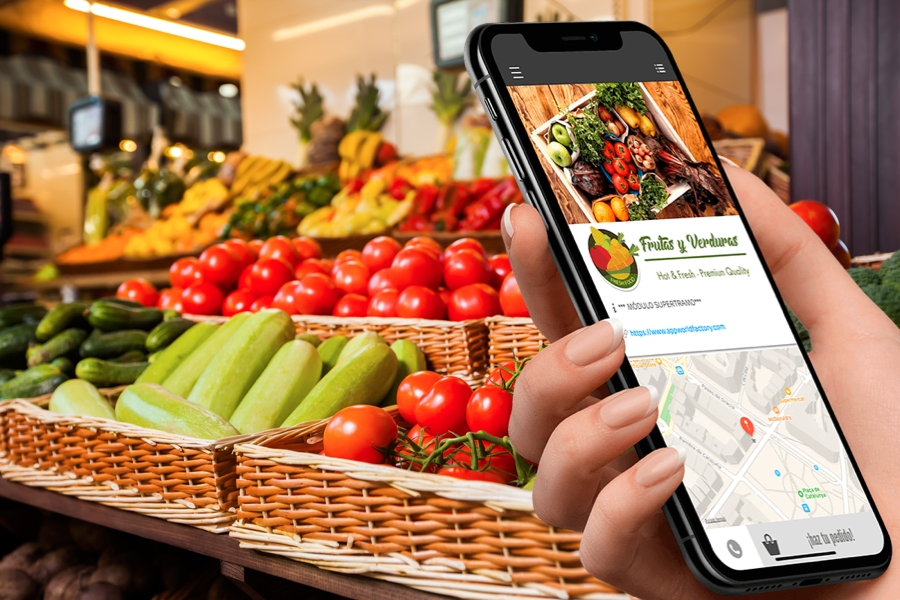
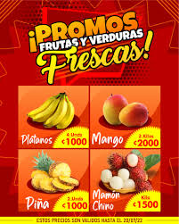
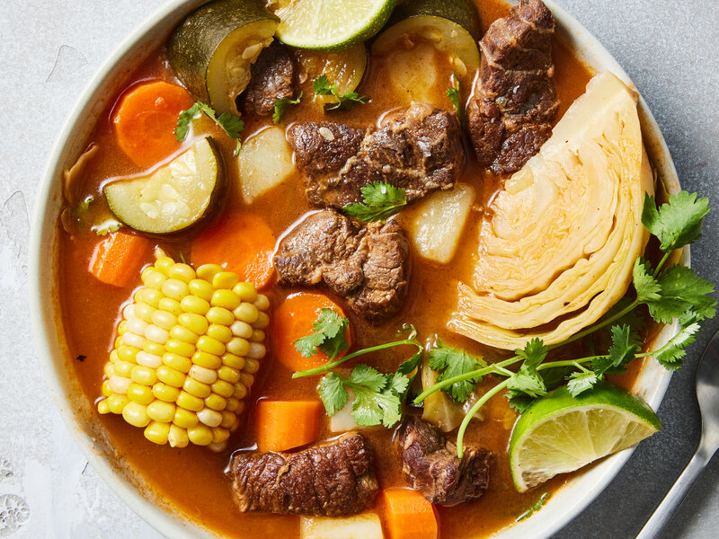

<html>
<head>
<meta charset="UTF-8">
<meta name="viewport" content="width=device-width, initial-scale=1.0">

</head>
<body>

    <h1>Frutería "El Plátano Riendo"</h1>
    
    
Catálogo en línea con lista de frutas y verduras frescas, precios diarios, ofertas destacadas y recetas saludables.

     <a href="file:///C:/xampp/htdocs/DW/ProyectoFinal/imagen.html">Inicio</a> 
    <a href="https://marcusfilidor.github.io/frutas/">Frutas</a> 
    <a href="https://marcusfilidor.github.io/verduras/">Verduras</a>
    <a href="https://marcusfilidor.github.io/ofertas/">Ofertas</a>
    <a href="https://marcusfilidor.github.io/recetas/">Recetas</a>
    <a href="https://marcusfilidor.github.io/contacto/" style="float:right">Contacto</a>

    

        

            <h2>Frutas Frescas</h2>
            <h5>Precios diarios, Diciembre 2024</h5>
            
            
En nuestra frutería, encontrarás una amplia selección de frutas frescas a los mejores precios del mercado.

            <ul>
                <li>Manzanas - $1.50 por kg</li>
                <li>Plátanos - $0.80 por kg</li>
                <li>Fresas - $2.00 por caja</li>
                <li>Ciruela - $2.00 por caja</li>
                <li>Durazno - </li>
                <li>Granada roja - </li>
                <li>Limón - </li>
                <li>Mango - </li>
                <li>Melon - </li>
                <li>Piña - </li>
                <li>Sandia - </li>
                <li>Uva - </li>

            </ul>
        
 

        
 
            <h2>Verduras Frescas</h2>
            <h5>Precios diarios, Diciembre 2024</h5>
             
            
Ofrecemos una gran variedad de verduras frescas, ideales para tus comidas saludables.

            <ul>
                <li>Lechuga - $1.00 por unidad</li>
                <li>Tomates - $1.20 por kg</li>
                <li>Zanahorias - $0.90 por kg</li>
            </ul>
        
 
    

    

        

            <h2>Sobre Nosotros</h2>
            
            
En "El Plátano Riendo" nos dedicamos a ofrecer productos frescos y de calidad para que tu alimentación sea lo más saludable posible.
 
        
 

        
 
            <h3>Ofertas Destacadas</h3> 
            
            
        

        

            <h3>Recetas Saludables</h3>
            
Descubre nuestras recetas fáciles y nutritivas para aprovechar al máximo las frutas y verduras frescas.

	    <a href="https://cookpad.com/mx/recetas/10837615-caldo-de-res-sencillo" target="_blank"> CALDO DE RES (SENCILLO)</a>    
            <a href="https://www.recetasnestle.com.co/recetas/ensalada-de-fruta-con-queso" target="_blank"> ENSALADA DE FRUTAS</a>
               
        

    

 
    <h2>Frutería "El Plátano Riendo"</h2>
    
&copy; 2024 Todos los derechos reservados

</body> 
</html>
